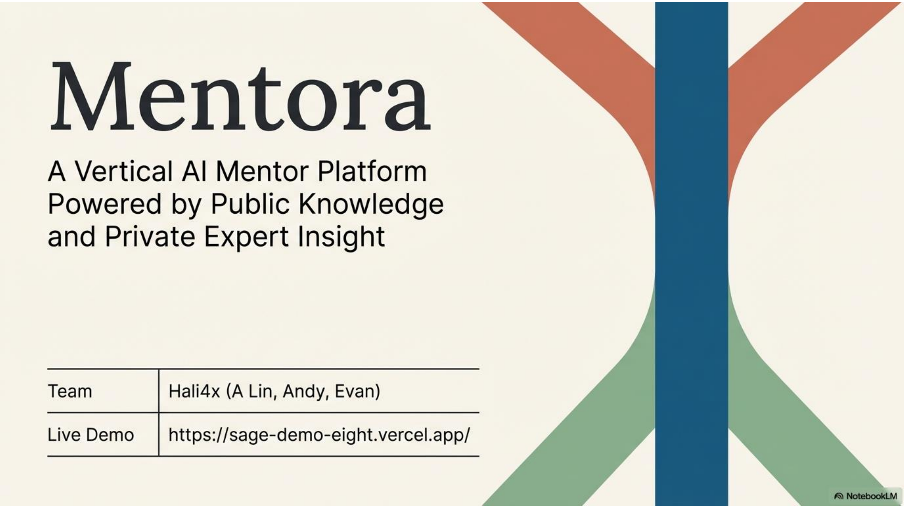
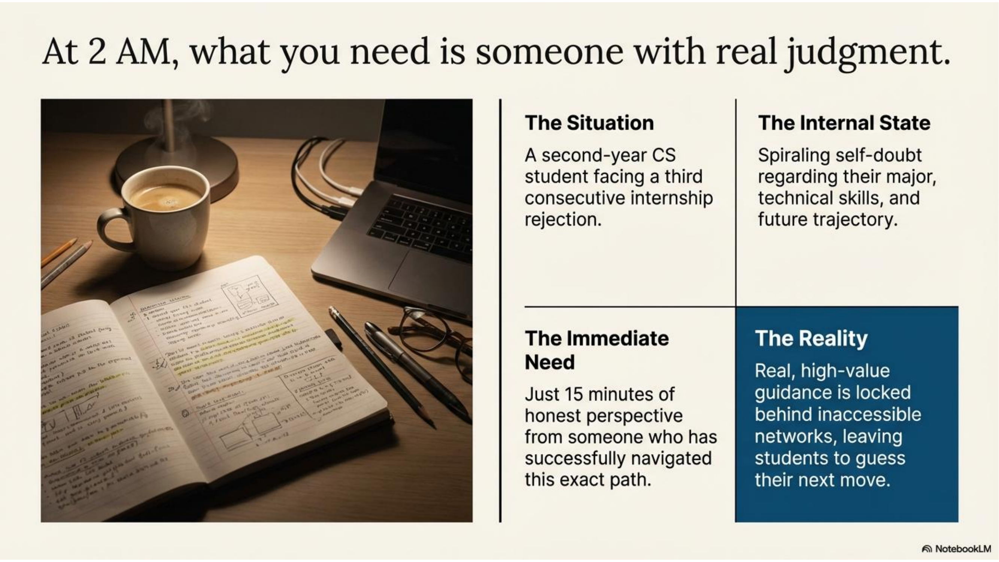
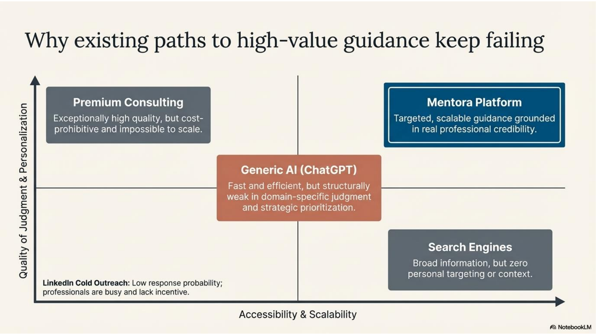
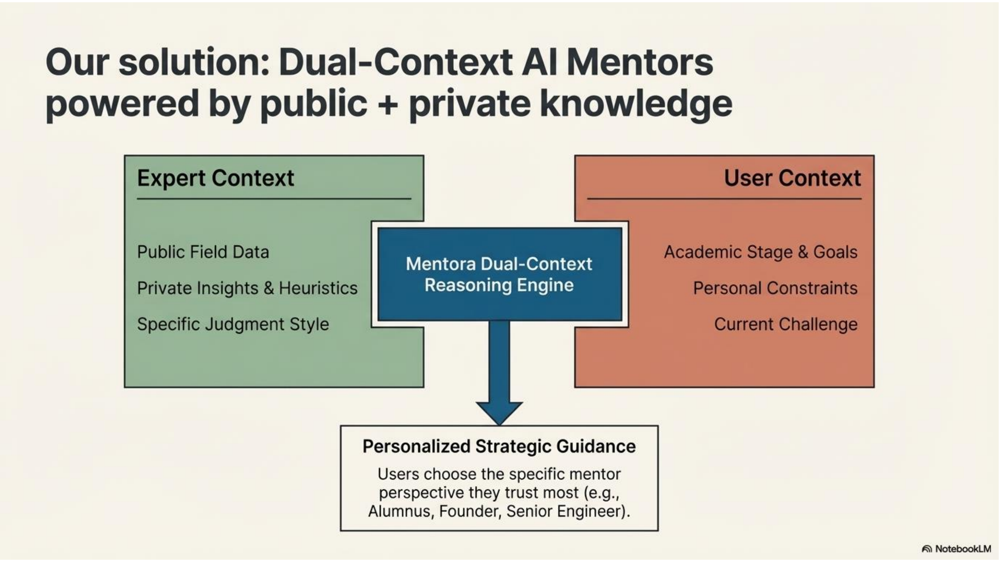
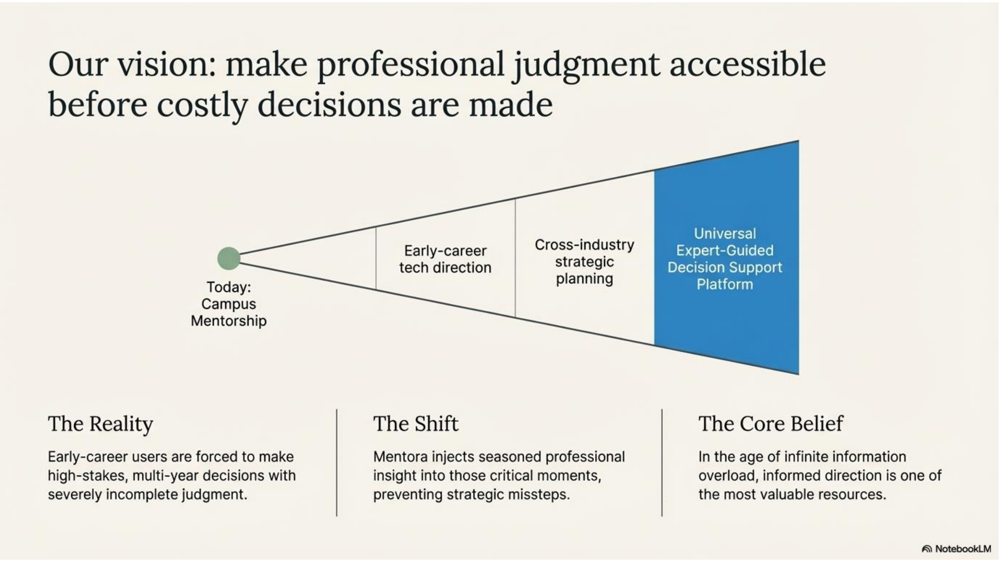

# Mentora Hackathon Prototype

Hackathon prototype for an AI mentorship platform that delivers personalized guidance through mentor discovery, user profiling, and conversational interaction.

## Overview

Mentora is a team-built prototype exploring how AI-powered digital mentors can provide more accessible, personalized, and judgment-oriented guidance for students and early-career users.

The project was developed during a hackathon and presented as a live demo and pitch deck.

## Demo

- Live demo: [Mentora Demo](https://sage-demo-eight.vercel.app/)
- Team repository: [sage-demo](https://github.com/allenyan513/sage-demo)
- Hackathon page: [Hack-to-the-Future](https://github.com/0x00wolf/Hack-to-the-Future)

## Problem

Students often work hard but still lack informed direction. Generic AI tools are fast and scalable, but they are often weak in domain-specific judgment, prioritization, and personalized strategic guidance.

## Core Idea

Mentora uses a dual-context mentorship concept:

- **Expert Context**: public field knowledge, private insights, heuristics, and judgment style
- **User Context**: academic stage, goals, constraints, and current challenges

These are combined to generate more personalized and strategically useful guidance.

## How It Works

1. Knowledge supply from mentors
2. User profile mapping
3. Mentor selection
4. Tailored output based on mentor perspective and user context

## Why This Project Matters

Mentora reflects an important idea: informed direction is often more valuable than raw information. The prototype explores how AI systems can support high-stakes personal and career decisions through context-aware, mentor-guided interaction.

## Team

Team Hali4X:
- A Lin
- Andy
- Evan

## My Contribution

I contributed as a member of the hackathon team in concept development, product framing, and project presentation. I participated in shaping the mentorship workflow, user-facing demo narrative, and overall positioning of the system as an AI-guided mentorship prototype.

## Tech Stack

- Next.js
- Tailwind CSS
- Vercel

## Project Status

This project is a hackathon prototype and demonstration system. It is not a production-ready platform and does not include a full backend or deployed AI inference pipeline.

